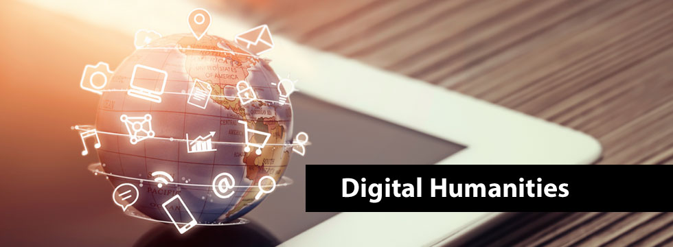
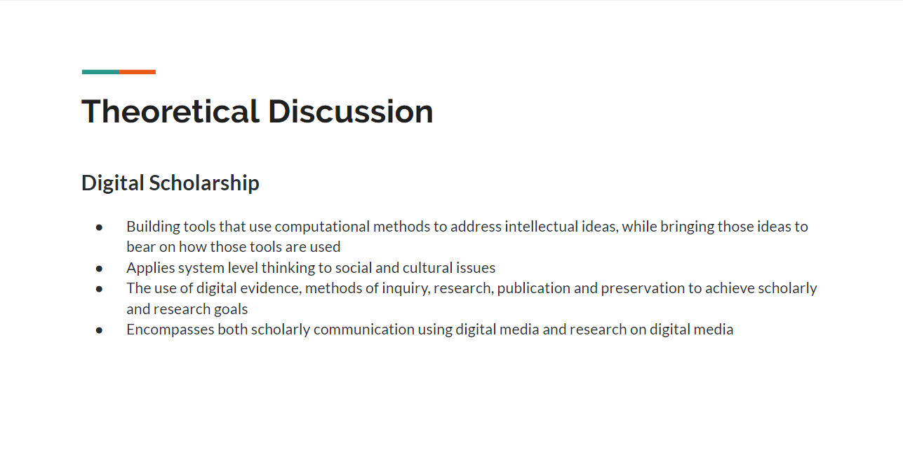
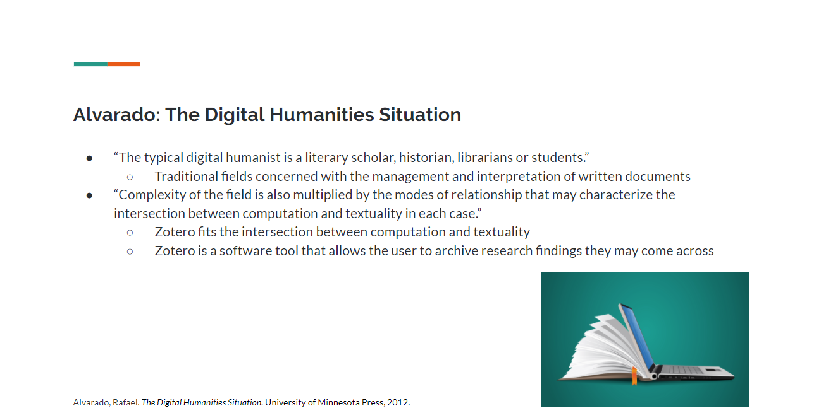

# IASC 2P02 | Brian Lee

## Bio

 My name is Brian Lee and this is my GitHub portfolio, I am currently a second-year student at Brock University in the Interactive Arts and Sciences program. The research area specific for this portfolio is text analysis, being a possible future research program, I have some interest in text analysis within the digital humanities field. To further this notion, the main feature of this portfolio is a text analysis of Graphs, Maps, Trees by Franco Moretti. Moretti brings forward compelling ideas that need further exploring in the digital humanities, but to understand the arguments that Moretti brings his work must be further analyzed. This analyzation helps to shed a new light but also reinforce the intriguing concept that Moretti brings in which the way text is meant to be interpreted. Another project that furthers my expertise of text analysis is through a collaborative project, where Alvarado’s article The Digital Humanities Situation was utilized to relate the article’s arguments with a research tool known as Zotero. Looking towards the future, text analysis is a specialization that will always be required in a field such as the digital humanities. This is due to how ideas and the workflow within digital humanities need to be analyzed and further reproduced in order to advance the digital humanities.

## Featured Project: [Title of project here]

Here are 250 words introducing this work.

Here is my 250 word statement describing how this research evolved over time. I made these changes, which you can see [here](https://github.com/brianlee1996/IASC-2P02/commit/6d9f00c4cdef0ecdd53af5c75821c182891408b8#diff-e95c7dc8eefee7d0e25121cd7f0007ae). I also made these changes, which you can see [here](https://github.com/brianlee1996/IASC-2P02/commit/f8b963eaa2c92139ca1e583040819d9e19316c31#diff-e95c7dc8eefee7d0e25121cd7f0007ae). I also made these changes, which you can see [here](https://github.com/brianlee1996/IASC-2P02/commit/588f461da65d89961adcd6aee52e45160d2adfb2#diff-e95c7dc8eefee7d0e25121cd7f0007ae). Overall these changes show x and y changes in my thinking.

Read [Title goes here](readme)

## Collaborative Project

 The digital humanities project that we researched for our collaborative project was the tool known as Zotero. Zotero is a tool that aims to turn the average internet user’s browser into a platform that can actively archive anything. Its expected use is for the compiling of sources and references for easy access and referencing across projects. From using this tool, we discovered that it has multimodal purposes, meaning that it can reference and save various types of image, audio and video files. The tool’s main function is to enable the user to research and discover articles then saves the information through Zotero.

 In terms of collaborative scholarship, the best method of working with others is having an open mind. Communicating concisely to others allows a working relationship to be built, which in turn improves the overall quality of the project being built. My personal contribution to this project was dealt with the (theoretical discussion)[ https://github.com/IascAtBrock/IASC-2P02-TeamPresentations/commit/15f6d5539423d1b91035ae42ac1de7812b8cff58#diff-263c9d16322b91363cd286714e70dc9f] portion of our presentation. I collaborated with another peer in this part, where we bounced ideas with one another with how various readings had a correlation to the research tool we were investigating, Zotero. With working another person in the theoretical discussion of our presentation, I was able to further my understanding of not only the tool itself, but also have a stronger grasp of the readings we used in our presentation. Collaborating with others gives you different outlooks, something you may have understood could be interpreted differently by someone else, which in turn can advance your overall knowledge of the subject. Approaching in collaboration with others requires flexibility, everyone works in their own time but you must find that common ground to produce a viable workflow. Collaboration is vital to text analysis; text analysis is based upon formulating opinions on the works of others but also your own. To properly analyze a text, you must build upon the work of others, in other words collaborating with others in the field of digital humanities is a way to advance the field into creating new ideas but also reinforcing old ones. My contribution to the presentation of our project on the research tool Zotero is visible in the two images provided below.

## Research Presentation

 [Commodore 64](https://brianlee1996.github.io/IASC-2P02/reveal/index.html)

## Academic Blog

 [What is a novel?](blog)
