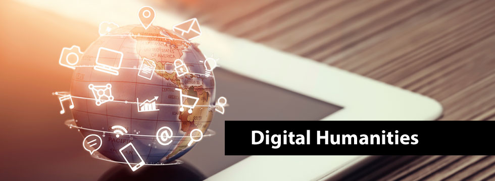

# IASC 2P02 | Brian Lee

## Bio

My name is Brian Lee and this is my GitHub portfolio, I am currently a second-year student at Brock University in the Interactive Arts and Sciences program. The research area specific for this portfolio is text analysis, being a possible future research program, I have some interest in text analysis within the digital humanities field. To further this notion, the main feature of this portfolio is a text analysis of Graphs, Maps, Trees by Franco Moretti. Moretti brings forward compelling ideas that need further exploring in the digital humanities, but to understand the arguments that Moretti brings his work must be further analyzed. This analyzation helps to shed a new light but also reinforce the intriguing concept that Moretti brings in which the way text is meant to be interpreted. Another project that furthers my expertise of text analysis is through a collaborative project, where Alvarado’s article The Digital Humanities Situation was utilized to relate the article’s arguments with a research tool known as Zotero. Looking towards the future, text analysis is a specialization that will always be required in a field such as the digital humanities. This is due to how ideas and the workflow within digital humanities need to be analyzed and further reproduced in order to advance the digital humanities.

## Featured Project: [What is a novel?](blog)

The way in media is interpreted constitutes to how an individual will learn the material. Graphs, Maps, Trees by Franco Moretti discusses a methodology in which the way data or information should be represented. One of the methods Moretti uses are visuals through graphs that illustrate the rise and fall of novels in the eighteenth and nineteenth century throughout various countries in Europe and Asia. The reasoning Moretti explains is of how external events have a direct impact to the wave-like pattern that occurs. Moretti uses this same ideology in the way genres have evolved over time, but he also discusses how genres tend to outright disappear. The methodology of how Moretti expresses these patterns is not at fault, but instead the reasoning he uses to juxtapose the idea of how genres and novels have changed over time in the history of literature. It is not just because of quantifiable data, but also the qualitative flair that authors or writers bring into literature. The number of published novels is due to interest, as in the interest of writers. This is also true with how genres evolve over time, it is the authors that control how a genre molds over time, not only because of external forces that Moretti expresses. The purpose of this blog is to express how the research Moretti uses is beneficial to literary history, but the way in which the research is interpreted by Moretti can contribute to false claims. Genres are as much based upon discourse as they are on temporality.

This blog has undergone a number of changes, the main feedback I had received was coming up with a coherent argument. This was done by connecting the arguments based upon the rise and fall of novel, and the temporality structure of genre that Moretti discusses. As shown [here]( https://github.com/brianlee1996/IASC-2P02/commit/8c5b2439b920cc707e0a78e22f031c658335f001#diff-e95c7dc8eefee7d0e25121cd7f0007ae), a new paragraph was added in order to reinforce the argument of how genres are developed over time. This was done in order to give the argument more material, in other words to express the argument in itself. Of how genres are not just a temporal means of change, but also are related to how the writers choose to write in that discourse of that genre. Another change to the blog was an attempt to further [explain](https://github.com/brianlee1996/IASC-2P02/commit/41e4cac8ebf683bd8edd4e2f4b0bc65bc0d1f592#diff-e95c7dc8eefee7d0e25121cd7f0007ae) what Underwood was expressing in their article. Prior to this change, Underwood’s quotation wasn’t heavily explained so in order to express their argument I added more material in order to support the claim of qualitative versus quantitative data. The last change that was made to this blog pertains to various small [details]( https://github.com/brianlee1996/IASC-2P02/commit/30036722a86d04176e6d2b7bf5b4ecaa9d6eb2a4#diff-e95c7dc8eefee7d0e25121cd7f0007ae). The reasoning behind this was to connect all of the new arguments that were implemented into the revised blog. The connection between the patterns of the rise and fall of the novel and the changes of genre that Moretti claims. This was done mainly to support my argument of how the interpretation of these patterns are not exactly the whole truth as Moretti attempts to suggest, but instead add new claims in which the examples Moretti uses can be interpreted.

Read [Title goes here](readme)

## Collaborative Project

The digital humanities project that we researched for our collaborative project was the tool known as Zotero. Zotero is a tool that aims to turn the average internet user’s browser into a platform that can actively archive anything. Its expected use is for the compiling of sources and references for easy access and referencing across projects. From using this tool, we discovered that it has multimodal purposes, meaning that it can reference and save various types of image, audio and video files. The tool’s main function is to enable the user to research and discover articles then saves the information through Zotero.

In terms of collaborative scholarship, the best method of working with others is having an open mind. Communicating concisely to others allows a working relationship to be built, which in turn improves the overall quality of the project being built. My personal contribution to this project was dealt with the [theoretical discussion](https://github.com/IascAtBrock/IASC-2P02-TeamPresentations/commit/15f6d5539423d1b91035ae42ac1de7812b8cff58#diff-263c9d16322b91363cd286714e70dc9f) portion of our presentation. I collaborated with another peer in this part, where we bounced ideas with one another with how various readings had a correlation to the research tool we were investigating, Zotero. With working another person in the theoretical discussion of our presentation, I was able to further my understanding of not only the tool itself, but also have a stronger grasp of the readings we used in our presentation. Collaborating with others gives you different outlooks, something you may have understood could be interpreted differently by someone else, which in turn can advance your overall knowledge of the subject. Approaching in collaboration with others requires flexibility, everyone works in their own time but you must find that common ground to produce a viable workflow. Collaboration is vital to text analysis; text analysis is based upon formulating opinions on the works of others but also your own. To properly analyze a text, you must build upon the work of others, in other words collaborating with others in the field of digital humanities is a way to advance the field into creating new ideas but also reinforcing old ones. My contribution to the presentation of our project on the research tool Zotero is visible in the two images provided below.

## Research Presentation

 [Commodore 64](https://brianlee1996.github.io/IASC-2P02/reveal/index.html)

## Academic Blog

 [What is a novel?](blog)
