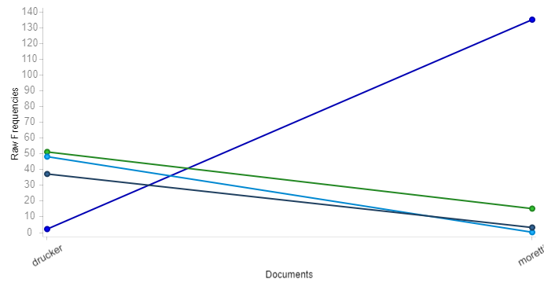

# What is a novel?

Graphs, Maps, Trees by Franco Moretti calls for a new approach of understanding literary history through the diversion of looking at texts with a different perspective, a perspective that argues to change in which the way reading is done. The main feature of Moretti’s argument is based upon the quantitative data he has provided, which includes the publication of novels at various timepoints in different countries. Moretti takes an interesting stance as to how he utilizes this quantitative data, Moretti explaining that this data is not interpretative, that the important turning points of the publication of novels must be decided on a different basis not related to the statistics. A basis that looks at how social and political factors have an impact on the rise and fall of the publication of novels. Using examples of censorship and war throughout the history of these countries, Moretti uses his graphs to pinpoint the various peaks and valleys as to when novels are being published. 

The development of genres is also another piece of supporting evidence that Moretti utilizes as quantitative data. He describes genres as the gap where flow and form meet, meaning that genres themselves help to dictate the landscape of literary history. As he does with the publication of novels, Moretti also looks at the temporality of genres, analyzing how genres disappear in groups, but also how genres sprout from one another. The forms change over time which directly leads to the genres becoming either displaced, replaced, or evolving into something different. The representation of how Moretti displays this quantitative data, the ebb and flow of the publication of novels and the invention of new genres, is the crux of Moretti’s argument. The crux being the way in which the interpretation of reading can be handled.

Although Moretti brings an interest idea in which the way data can be interpreted, the way he uses examples to chart his theory can be misleading. He utilizes graphs to quantify the number of novels per years, and what Moretti brings to attention is the wave-like pattern that rises and falls due to a varying number of governmental, social or economic reasons. Moretti uses this same principle in how he identifies how genres have developed or evolved over time. I disagree with how he attempts to quantify the development of genres through visualization. Genres require qualitative principles, in literary terms they are what differentiate a novel from another novel. Genres are created from the interests of multiple people that share similar ideas in the material they are writing. They do not disappear in such the way Moretti suggests, instead they continue on in another theme or approach.

The main focal point that Moretti is trying to suggest the usage of these models, graphs, maps and trees will allow for new forms of analysis in the literary field. Although I see an issue in how he uses the publication of literary history specific to novels. Simply counting the amount of publications to juxtapose the idea of the rise and fall of novels is a narrow-minded way of analyzation. Moretti explains as to how social, political and even economic factors have an impact to the number of publications in varying countries, but are the publication of novels the only contributing factor as to what is a novel? Drucker creates a similar point in Humanities Approaches to Graphical Display, 

“A standard critique of data introduces reservations about the appearance of certainty such a chart presents. What counts as a nation? Are transient and immigrant populations documented? What kind of time span counts as “at the present time” within which these populations are counted?” 

The point Drucker is making is that data in itself is already an interpreted expression, meaning that certain things can be drawn off a chart, and that a chart is not limited to the numbers it is representing. Moretti explicitly alludes to the notion that the only importance of novels are the ones that are published, yet he does not account for novels that may have gone unrecorded in literary history. This suggests that the data is now unrepresentative of the whole, how can you dictate the rise and fall of novels in a nation’s history when there can be as many novels that have gone undocumented? As much as the rise and fall of the publication of novels fluctuates, by focusing on only the novels that have been published it is a distorted conception of reality. 

Moretti’s claim is that quantitative data is the whole truth, but disclaiming sets of data in a way is an interpretation of data. An interpretation of data that is suggesting an acknowledgement of the data that is not being represented. Quantitative data can be qualitative when there is an attempt to understand what the quantitative data is representing as suggested by Underwood in Distant Reading and Recent Intellectual History. 

 “That conceptual advance would be interesting in itself. But it also allows researchers to include qualitative evidence like text in a    quantitative model by the simple expedient of using lots of variables (say, one for each word). Social scientists can now connect structured social evidence to loosely structured texts or images or sounds, and they’re discovering that this connection opens up fascinating questions.”

Underwood explains as to how the representation of unstructured texts led to a difficult divide from the quantitative social sciences and the humanities. This in part is similar to what Drucker was explaining, that data can be interpreted past the digits, that it is representative through the meanings of what the data is acknowledging. What can be drawn from Underwood is that this topic must be viewed in a broader sense. Literary studies are not just specific to those that attempt to interpret literature, and instead we should be understanding connections to other disciplines. The introduction of the opinions from different disciplines changes the way we experience quantitative and qualitative evidence, a change that makes both forms of evidence far easier to combine. As discussed, one of the issues with Moretti’s point is how he believes data is meant to be interpreted. The issue lies in the examples that Moretti use, how the publication of novels doesn’t necessarily underlie the notion of a rise and fall of literary media.

 

This visualization from the Voyant tool showcases the trends of the words novel, time, information and interpretation in both Moretti and Drucker’s work. The reasoning behind this visualization was to showcase how often Moretti emphasizes the usage of novel in his work whereas Drucker emphasizes time, information and interpretation. This difference articulates the varying stances that have been discussed, Moretti claimed how statistical data in relation to novels can only be interpreted through the numbers and only the numbers, yet as discussed Moretti’s dissociation with what can be classified as a novel devalues his claim.
  
Though the methods of which Moretti exercises do indeed contribute towards a newer way of understanding literary history, there is still a misconception in which the way it is misinterpreted. This misinterpretation is from how Moretti only displays his information for novels that were published, and does not acknowledge the ones that may not have had the opportunity to be published or lost in the flow, even though they may be as much a novel as those that were published. The support that Moretti uses to create his claims doesn’t acknowledge the larger domain that is more representative of what the rise and fall of a novel may actually be.
